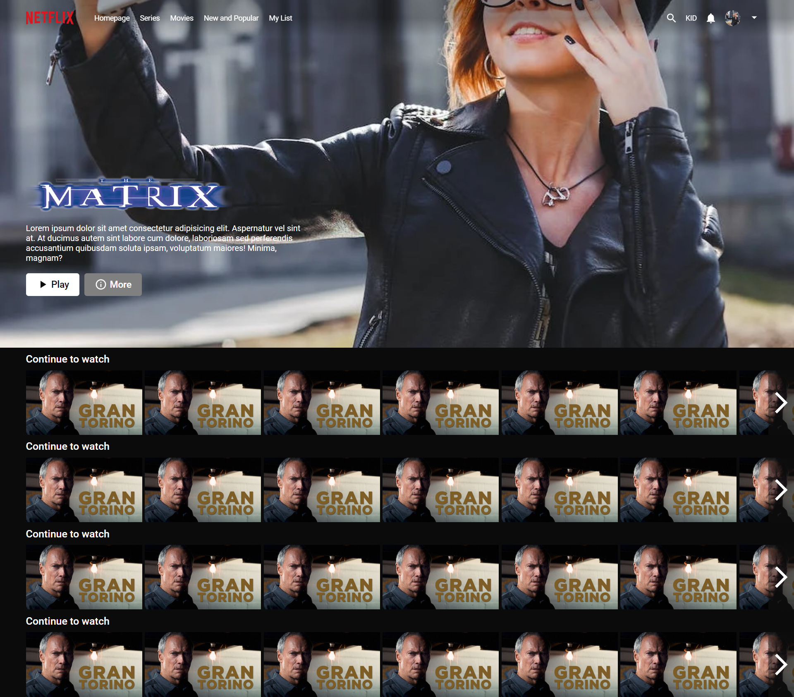
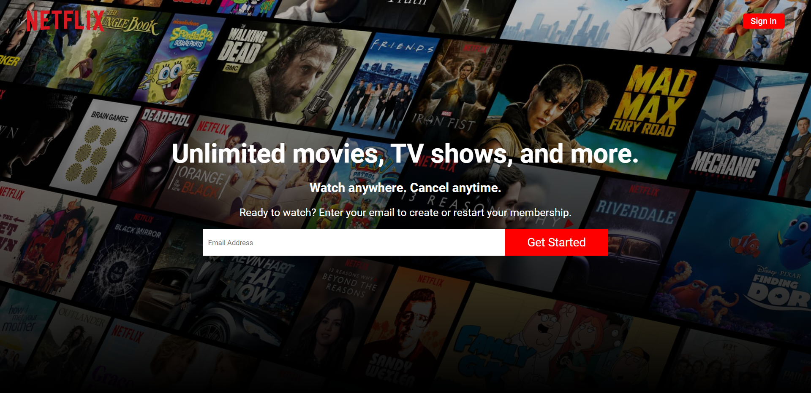
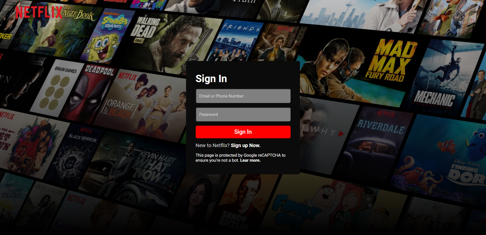

# Netflix Clone UI - React Netflix Replica



Welcome to the Netflix Clone UI project! This is a front-end user interface built using React that replicates the user interface of the popular streaming platform Netflix. The UI includes a home page, register page, login page, and a watch page. The aim of this project is to provide users with an experience similar to using Netflix.

## Table of Contents

- [Introduction](#netflix-clone-ui---react-netflix-replica)
- [Features](#features)
- [Screenshots](#screenshots)
- [Installation](#installation)
- [Usage](#usage)
- [Contributing](#contributing)

## Features

- **Home Page:** Displays featured movies and TV shows to engage users.
- **Register Page:** Allows users to create an account to access the platform.
- **Login Page:** Enables users to log in to their accounts.
- **Watch Page:** Provides a movie or TV show to watch.

## Screenshots


_Home Page_


_Register Page_


_Login Page_


_Watch Page_

## Installation

1. Clone the repository using the following command:

   ```bash
   git clone https://github.com/sadanmian/Netflix.git
   ```

2. Navigate to the project directory:

   ```bash
   cd Netflix
   ```

3. Install the required dependencies:

   ```bash
   npm install
   ```

## Usage

1. Start the development server:

   ```bash
   npm start
   ```

   This will launch the website in your default web browser. You can access it at `http://localhost:3000`.

2. Navigate through the different pages using the navigation links provided.

3. Register an account or log in to start exploring and using the watch feature.

4. Browse available content on the home page and click on a movie or TV show to enter the watch page.

## Contributing

Contributions are welcome! If you'd like to contribute to this project, please follow these steps:

1. Fork the repository.
2. Create a new branch for your feature or bug fix.
3. Make your changes and test them thoroughly.
4. Commit your changes with clear and concise commit messages.
5. Push your changes to your forked repository.
6. Create a pull request explaining your changes and their purpose.
